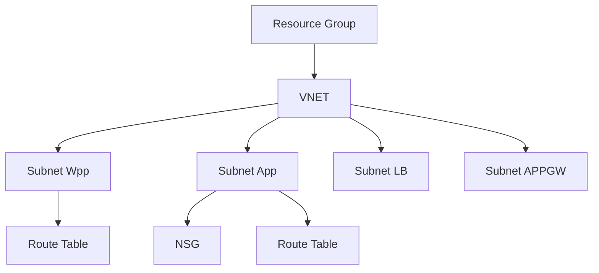

### Level 01: Basic Azure Resources Setup (VNET, Subnet, Resource Group, NSG, Route Table)

#### **Requirements:**
1. **Virtual Network (VNET)**: Create a VNET with a specific address space (e.g., 10.0.0.0/16).
2. **Subnet**: Create multiple subnets in the VNET. each with its own address range.
3. **Resource Group**: Define and create a resource group to contain all resources.
4. **Network Security Group (NSG)**: Associate an NSG with subnets.defining security rules to control inbound and outbound traffic.
5. **Route Table**: Create a custom route table and associate it with a subnet.

#### **Considerations:**
- Ensure the address spaces of subnets don't overlap.
- NSG rules should be configured based on the least privilege principle, allowing only required traffic.

#### **Functions and Concepts:**
- **Use**: `for_each` to create multiple subnets.
- Providers: Use the Azure provider to set up all resources.
- `resource` block: Define each resource (e.g., VNET, Subnet, Resource Group).
- `nsg_rules` block: Use this block to define NSG rules for controlling traffic.
- `route` block: Define routes in the route table to manage network traffic.

#### **Optional and Tools:**
- **Tools**: TFLint for linting, terraform-docs for documentation generation.
- **Other Tools**: Consider Pre-commit hooks and Checkov for security scanning.

#### **Mermaid Diagram**:

