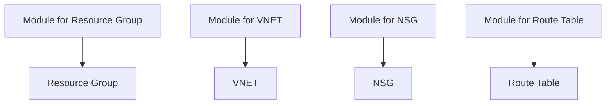

### Level 02: Create Modules for Resource Providers

#### **Requirements:**
1. **VNET Module**: Design a reusable module that includes the VNET and Subnets.Parameterize address space and subnet ranges.
2. **NSG Module**: Build a module that allows creating NSGs with customizable security rules. Accept rules for inbound and outbound traffic via parameter.
3. **Route Table Module**: Create a module for route tables, where routes can be easily added. Allow adding custom routes.
4. **Resource Group Module**: Implement a module to create resource groups that can be reused across different environments.

#### **Considerations:**

- Ensure each module is reusable and follows best practices (inputs and outputs).
- Focus on making modules easy to consume in future projects.
- Make the modules as reusable and configurable as possible. This includes parameterizing inputs for VNET address space, subnet ranges, security rules for NSGs, and custom routes.
- Ensure outputs from the modules are structured in a way that they can be referenced easily in other projects (e.g., VNET ID, Subnet ID, NSG ID).

#### **Functions and Concepts:**

- **Module:** Use `module` blocks to define reusable modules for various resources.
- **Input variables:** Parameterize the modules to accept inputs like VNET address space, subnet CIDR, and NSG rules.
- **Output values:** Provide outputs that expose critical information such as resource IDs, subnet names, etc.
- `locals` block: If necessary, use local values to compute or store intermediate values within modules.

#### **Functions and Tools:**
- **Use**: `for_each` for rules and subnets, `map` objects to allow flexible input configurations.

- **Tools**: TFLint, terraform-docs, Pre-commit.

#### **Mermaid Diagram**:

---