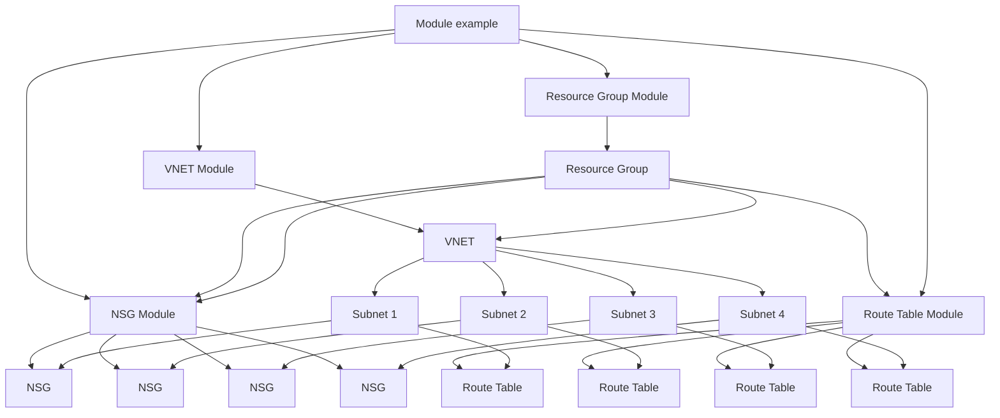

### Level 03: Consume Modules to Create (VNET, Subnet, Resource Group, NSG, Route Table)

#### **Requirements:**
1. **VNET and Subnet**: Consume the VNET module to create a virtual network with specified address space and subnets.
2. **NSG**: Use the NSG module to create security groups and associate them with subnets. 
3. **Route Table**: Leverage the route table module to create and attach custom route tables to subnets.
4. **Resource Group**: Create and assign all resources to a specific resource group using the resource group module.

#### **Considerations:**
- Handle dependencies between resources, especially subnets and VNET.
- Use `depends_on` to manage resource creation order.
- Ensure module inputs are properly passed, including CIDR blocks, NSG rules, and route configurations.
- Plan resource dependencies properly so that resources like subnets are created only after the VNET is created.
- Use appropriate tags and naming conventions for easy resource management.

#### **Functions and Tools:**
- **Use**: `depends_on` for proper resource dependency.
- **Remote State**: If using multi-environment, consider remote state data to share resources.
- **Tools**: TFLint, terraform-docs.

#### **Mermaid Diagram**:

---