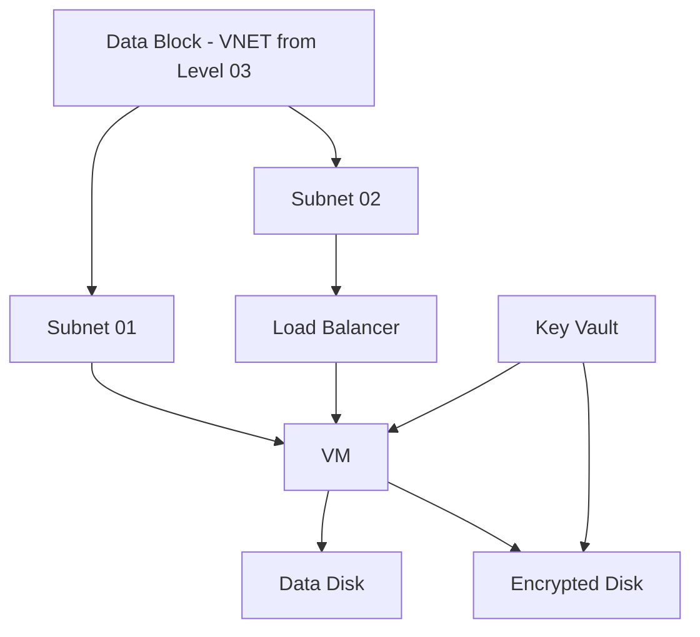

### Level 04: Use Level 03 as Data Block and Create Additional Resources

#### **Requirements:**
1. **Subnet 01**: Create a new subnet, if required.
2. **Virtual Machine (VM)**: Deploy a VM in Subnet 01.
3. **Load Balancer**: Set up a load balancer to distribute traffic across VMs.
4. **Storage Account**: Add a storage account for the VM.
5. **Encrypt Disk**: Encrypt the VM disk using Customer Managed Key (CMK) from Azure Key Vault.

#### **Considerations:**
- Use `data` block to reference resources from Level 03 (like VNET and subnets).
- Ensure correct key vault integration for disk encryption.

#### **Functions and Tools:**
- **Use**: `data` blocks for resource reference, `for_each` for multiple resources (e.g., VMs).
- **Tools**: TFLint, terraform-docs, Key Vault integration.

#### **Mermaid Diagram**:
